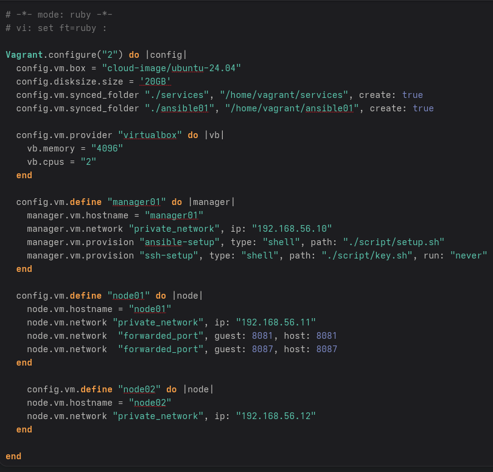
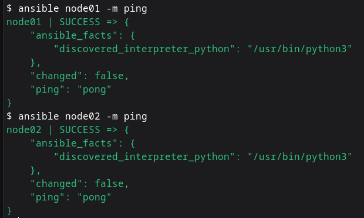
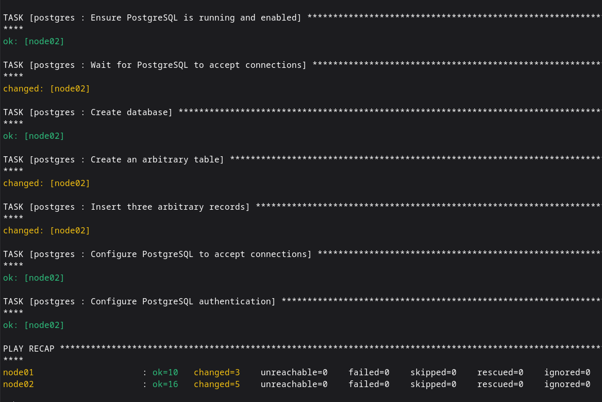
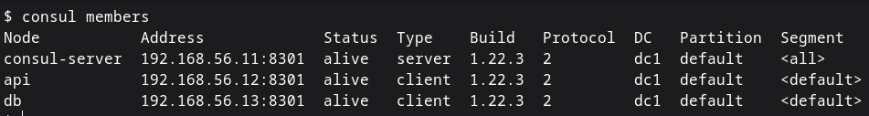
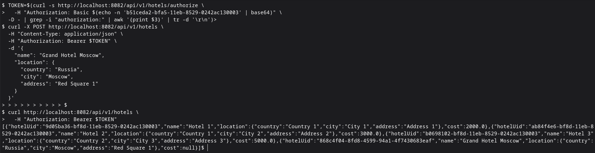

## 1st Task
- for the first task I needed first to write docker compose and dockerfile first.
- then I start to create folder structure for Ansible.
- after that I wrote simple script just to install Ansible and share ssh key to other machines then I build vagrant file: 
- 

- now to get the machines up I run `vagrant up && vagrant provision --provision-with ssh-setup manager01`
- and finally I do run the postman test using command `newman run test.json` that found in services folder
- after setup ansible and make sure ssh works passwordless, we can try ansible ping
- 
- and this is the picture of successful run of Ansible playbook with the tasks that required :
- 

## 2nd Task

- I created a new vagrant file under folder ansible02
- 
- And I config ansible like the last task
- after that I install and setup Consul
- 
- The final think insure everything works, I did the test CRUD operations on the hotel service
- 
